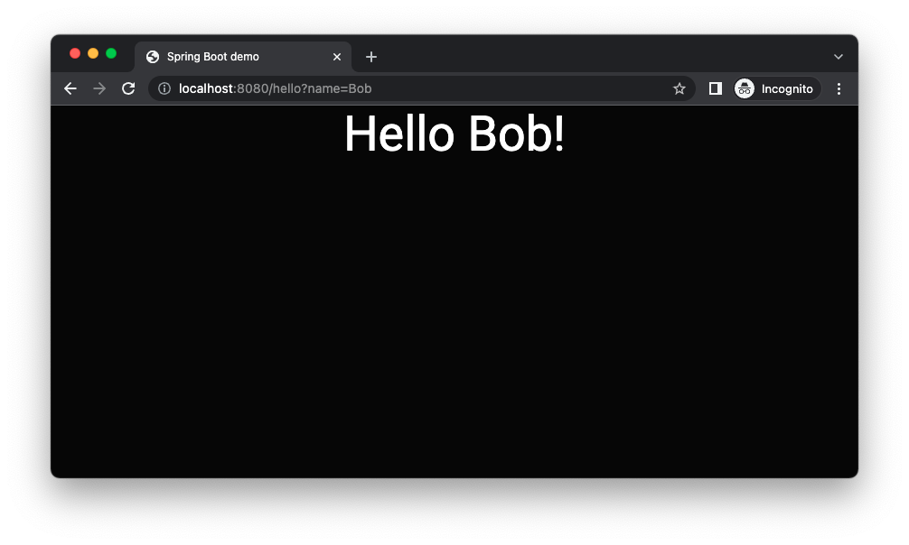

# springboot-demo
Simple spring boot application delivering jsp files.

## Table of contents
* [General info](#general-info)
* [Technologies](#technologies)
* [Features](#features)
* [Screenshots](#screenshots)
* [Setup](#setup)
* [Status](#status)
* [License](#license)

## General info
Goal of project is to learn how to create simple spring boot project.

## Technologies
* [Official Apache Maven documentation](https://maven.apache.org/guides/index.html)
* [Spring Boot Maven Plugin Reference Guide](https://docs.spring.io/spring-boot/docs/2.6.4/maven-plugin/reference/html/)
* [Spring Web](https://docs.spring.io/spring-boot/docs/2.6.4/reference/htmlsingle/#boot-features-developing-web-applications)
* [Bootstrap](https://getbootstrap.com/)

## Features
* Count square using WebAssemby module.

## Screenshots



## Setup
How to run this project.

1. Clone this repo

2. To run, go to project folder and run

```mvn package```

4. Run application

```mvn spring-boot:run```

6. Visit: http://localhost:8080/
7. Visit: http://localhost:8080/hello?name=Bob

## Status
Project is finished.

## License
MIT